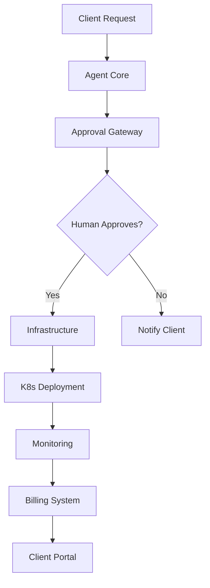

# Cronnecture Agentic Business System

Complete automation stack for Cronnecture's hosting business.

## Architecture

## Subrepos Structure

### Core System
- **agent-core** - Main orchestration and decision engine
- **approval-gateway** - Human approval workflows and notifications

### Infrastructure  
- **infrastructure** - Kubernetes manifests and Ansible playbooks
- **monitoring** - Proactive monitoring, alerting, and health checks

### Business Logic
- **billing** - Stripe integration and automated invoicing
- **client-onboarding** - Automated project creation pipeline
- **templates** - Website/webshop/portal templates and generators

### Operations
- **deployment** - CI/CD pipelines and release automation
- **security** - SSL management, backups, compliance

## Service Tiers

### Website (€899 + €49.99/mo)
- Static site generation
- Basic monitoring
- SSL automation

### Webshop (€1,699 + €119.99/mo)  
- E-commerce platform
- Payment processing
- Inventory management

### Portal (€4,999 + €129.99/mo)
- Custom applications
- Database management
- Advanced integrations