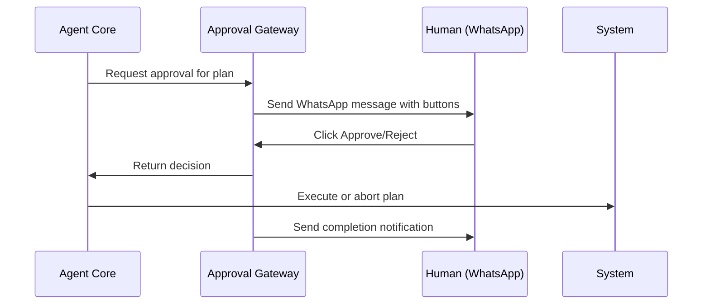

# Approval Gateway - Human Oversight System

## Overview
Manages human approval workflows with WhatsApp/Slack integration for critical business decisions.

## Architecture

```python
class ApprovalGateway:
    def __init__(self):
        self.channels = {
            'whatsapp': WhatsAppNotifier(),
            'slack': SlackNotifier(),
            'email': EmailNotifier()
        }
        self.approval_store = RedisStore()
        
    async def request_approval(self, plan):
        approval_id = self.generate_approval_id()
        
        # Store plan for reference
        await self.approval_store.set(approval_id, plan.to_dict())
        
        # Send notification with approve/reject buttons
        message = self.format_approval_message(plan, approval_id)
        await self.channels['whatsapp'].send(message)
        
        # Wait for response (timeout after 1 hour)
        response = await self.wait_for_approval(approval_id, timeout=3600)
        return response.approved
```

## Approval Types

### High Priority (Immediate notification)
- New client deployments
- Payment processing issues
- Security incidents
- Service suspensions

### Medium Priority (Batched notifications)
- Resource scaling requests
- Template updates
- Configuration changes

### Auto-Approved (Notification only)
- SSL renewals
- Routine backups
- Health check fixes
- Minor patches

## Integration Channels

### WhatsApp Business API
- Primary channel for urgent approvals
- Rich buttons for approve/reject
- Image attachments for deployment previews

### Slack Integration  
- Backup channel for team notifications
- Thread-based discussions
- Integration with incident management

### Email Fallback
- Detailed approval requests
- Audit trail and documentation
- Weekly summary reports

## Approval Flow

