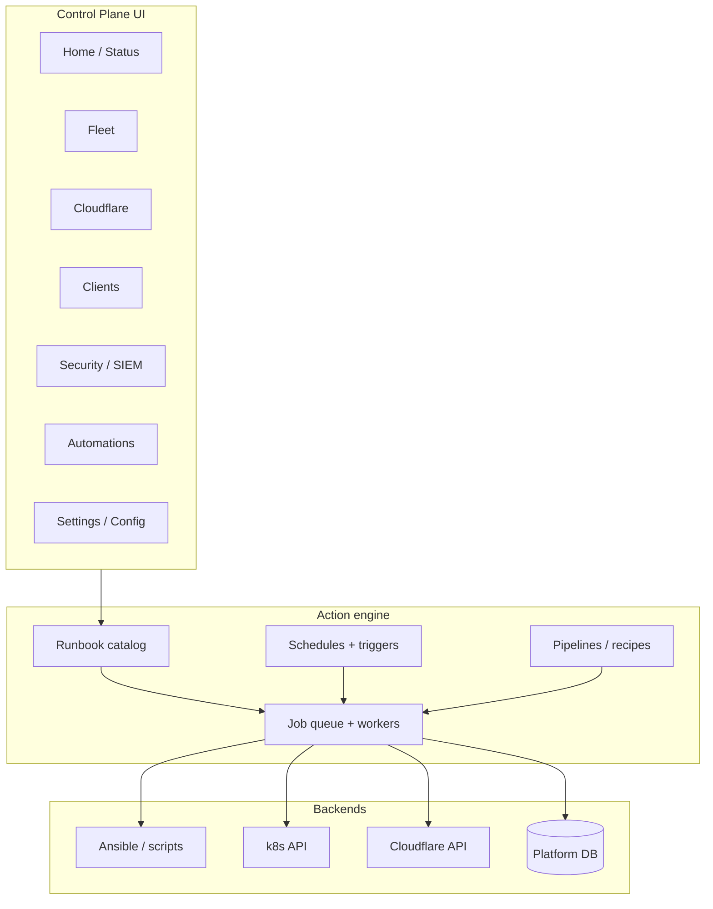

# Control Plane — “manage everything” roadmap

> **Near-term go-live:** [first-clients.md](../business/first-clients.md) and [roadmap.md](roadmap.md). This file is the longer UI/automation north star.

Goal: **one dashboard** for fleet, platform, Cloudflare, clients, security, and automation — with **single-click** (or zero-click) actions, no SSH/`make` required for normal ops.

Principles:

1. **Every repeated action becomes a Job** — same progress UI, history, cancel where safe.
2. **Catalog-driven** — playbooks/scripts/API ops live in `config/policies/fleet-operations.yml` (loaded as `FLEET_OPERATIONS`); UI copy stays in `fleet_runbook_meta.py`. UI is generated, not hand-wired per button.
3. **Inspect vs mutate** — read-only panels never block writes; destructive ops need impact tags + confirm (or policy).
4. **Secrets stay out of the browser** — vault-backed; UI triggers wizards/jobs on the control host, never displays raw keys.
5. **Automations are first-class** — schedule, chain, and conditionally run from the UI (not only crontab on the server).

---

## Current coverage (multi-plane)

Planes today: Welcome, Infrastructure (**Fleet** nav: Topology · Cluster · Nodes · **Self-heal** · Previews), Security, Business, Automation, Settings, CRM, DMS (`dashboard_registry.py` / `plane-ia.js`). Legacy `/quickops*` redirects to **Fleet → Self-heal** (`/infrastructure/selfheal`).

| Area | In UI today | API exists, UI thin/missing | CLI / repo only |
|------|-------------|-----------------------------|-----------------|
| **CRM / clients** | Create, apps, routes, access, portal, billing, delete (+ dry-run) | Connector install edge cases | `client_connector_remove.yml` |
| **Customer portal** | Path hub on `client.cronnecture.com` | — | Legacy `insights.*` cleanup |
| **Cloudflare** | Inventory, reconcile, cleanup (Cluster orphan sweep) | — | `cf-mint`, token rotation, `make cloudflare` |
| **Business** | Mail, billing settings, documents | — | — |
| **DMS** | Client DB connections / diagrams | — | — |
| **Security / SIEM** | Security HQ + Wazuh link | Deep alert UX | `make siem` |
| **Automation** | Presets / backups panel | Full schedule editor | host crontab via `fleet_ops` |
| **Self-heal** (Fleet) | Watchdog status, heal rates, policy chips, action timeline | — | `incident-watchdog.sh` / Makefile ops |
| **Infrastructure** | Topology, cluster, nodes, self-heal | — | edit `hosts.ini` by hand |

---

## Target experience (north star)

**Home** — one screen: fleet health, tunnel/connectors, failing jobs, clients needing action, SIEM alerts count, “recommended next steps” (e.g. stale Access, pending zone).

**Automations** — user-defined: “every night 03:00 backup”, “on client create → clients + connector”, “if health fails → notify + optional rerun”.

---

## Phase 1 — Unified command center (4–6 weeks)

*Make everything that already exists reachable in one place, with consistent UX.*

### 1.1 Platform **Home** workspace

- New sidebar item **Home** (default landing after login).
- Widgets: overall status (from `/api/architecture`), open jobs, last backup/health, tunnel connector counts, client count, leads unread.
- **Quick actions** row: Health check, Backup, Reconcile all CF, Sync inventory, Redeploy control plane (with impact labels).

### 1.2 Close API ↔ UI gaps

| Action | Work |
|--------|------|
| Inventory cleanup | Button on Inventory (wire `POST /api/inventory/cleanup`) |
| Fleet inventory sync | Already partial; unify naming with Inventory sync |
| Connector install/restart | Client **Infrastructure** tab: Install connector, Restart connector |
| Global access cleanup | Fleet or Inventory: wire `POST /api/cloudflare/access/cleanup` |
| Job console everywhere | Shared bottom/side job dock on Home, Inventory, Client deploys |

### 1.3 Runbook catalog completion

- Add missing playbooks to `FLEET_OPERATIONS`: `client_connector_remove`, scoped `cluster --limit`, `upgrade` as `make upgrade` alias.
- **Run with limits**: optional UI fields `limit`, `tags`, `extra_vars` (generic form from catalog metadata).
- **Recipes** (fixed chains): e.g. “New client edge” = `clients` → `client_connector` → reconcile one client (single button, sequential jobs).

### 1.4 Documentation in UI

- Each runbook: “Docs” link to `docs/` anchor or in-app drawer (markdown render of `fleet_runbook_meta` + link to OPERATIONS.md).

**Exit criteria:** No routine task requires SSH; Inventory and Fleet don’t duplicate confusing sync buttons; every `POST` fleet/client/cf job appears in **Activity**.

---

## Phase 2 — Config & security surfaces (4–6 weeks)

*Manage fleet configuration and SIEM without editing the repo by hand (safe subsets only).*

### 2.1 **Settings → Fleet config** (safe edit)

- Extend read-only Inspect config to **editable** allowlist keys in `group_vars/all/main.yml` + `k3s_cluster.yml` (version strings, feature flags, replica counts, non-secret URLs).
- Flow: form → validate → git-less write via ansible control path → optional job “apply” (`cluster` or `control_plane` as suggested follow-up).
- **Inventory editor**: structured host list (not raw INI first): add/remove group membership, `ansible_host`, display-only secrets.

### 2.2 **Security / SIEM** workspace

- New sidebar **Security**:
  - SIEM status panel: manager reachable, agent count vs fleet nodes, link to Wazuh UI.
  - Runbooks: `siem`, agent restart (new ansible op), “sync SIEM node only” (`--limit siem`).
  - Embed or iframe alert summary if Wazuh API credentials stored in vault (read-only KPIs).
- Architecture node click → “Run siem converge” / “View agents missing”.

### 2.3 Client lifecycle hub

- **Clients** tab (Fleet): bulk select → Reconcile CF, Sync tunnels, Install connectors, Suspend, Export manifest.
- **Onboarding wizard**: zone → tunnel → connector → first app (single guided flow, persists progress).

### 2.4 Secrets & tooling wizards

- `cf-mint` / `r2-registry`: not raw SSH — job with **typed parameters** where scripts support env vars; otherwise “Run on control host” with log stream only.
- Audit log table: who ran what job (Cloudflare Access email from request headers + timestamp).

**Exit criteria:** SIEM visible from ops UI; safe config changes without vim; bulk client ops in one screen.

---

## Phase 3 — Automations & pipelines (6–8 weeks)

*Single-click becomes zero-click where appropriate.*

### 3.1 Automation engine (DB + API)

- Tables: `automation_rule` (cron expression or event), `automation_action` (operation_id + params), `automation_run` (history).
- UI **Automations**: list, enable/disable, create, duplicate, run now.
- Leader pod runs scheduler (reuse `leader_loop` pattern from cache warmer).

### 3.2 Built-in presets (one-click enable)

| Preset | Schedule | Actions |
|--------|----------|---------|
| Nightly backup | `0 3 * * *` | `backup` |
| Health watch | `*/15 * * * *` | `health` |
| CF drift sync | `0 * * * *` | `cloudflare` + inventory sync |
| Weekly placement | `0 6 * * 1` | `rebalance` |
| Post-deploy hook | on `job.completed` type deploy | `clients` for that client |

### 3.3 Pipelines (recipes)

- YAML or UI builder: ordered steps with `on_failure: stop|continue`.
- Examples: **Full platform refresh** (syntax check → cloudflare → control_plane), **Client go-live** (clients → connector → portal provision).

### 3.4 Notifications

- Webhook (Slack/Discord/generic), email via existing SMTP or Supabase edge function.
- Trigger on: job failed, health degraded, tunnel connectors 0, SIEM critical alert (phase 2 API).

**Exit criteria:** Cron on control node manageable from UI; at least 3 presets toggled without SSH; one pipeline runnable from Home.

---

## Phase 4 — Deep K8s & observability (6+ weeks)

*Kubernetes and runtime control without kubectl.*

### 4.1 Workloads workspace

- Per client namespace: deployments, pods, events, logs tail (last N lines), restart rollout, scale replicas (within max).
- Platform namespace: same for control-plane, traefik — guarded by role.

### 4.2 Metrics & logs (optional integrations)

- Link or embed Grafana/Prometheus if deployed; else lightweight CPU/mem from metrics API (already partial in architecture).
- **Log search**: Loki or Wazuh forwarded logs — search from Security tab.

### 4.3 GitOps / deploy triggers

- “Redeploy all apps for client” → enqueue deploy jobs for each app.
- GitHub webhook → control plane → deploy job (optional, client-scoped secret).

### 4.4 Policy & RBAC

- Cloudflare Access groups per route: admin vs operator (operator: no destructive, no reset_fleet).
- Feature flags in DB for which runbook categories each “role” sees.

**Exit criteria:** Common k8s ops from UI; operators can’t run destructive catalog entries.

---

## Implementation conventions (every phase)

### Adding a new “one-click” capability

1. Implement backend in `fleet_service` (`kind`: playbook | script | ansible | api | bin | **k8s** future).
2. Document in `fleet_runbook_meta.py` (summary, scope, duration, impact, does[]).
3. UI picks it up automatically in Runbooks; add to Home/Quick action only if high frequency.
4. Register job type in `job_stages.py` for progress labels.
5. Add row to OPERATIONS.md / SIEM.md if operational.

### Job model extensions (when needed)

- `job.payload_json` for limit/tags/extra_vars/client_id.
- `job.parent_id` for pipelines.
- `job.cancel_requested` for long ansible runs (best-effort).

### UI information architecture (target sidebar)

| Nav | Purpose |
|-----|---------|
| **Home** | Status + quick actions + automations summary |
| **Fleet** | Nodes, Inspect, Runbooks, Activity |
| **Cloudflare** | Inventory + reconcile + cleanup + Access drift |
| **Clients** | Workspaces (existing) + Fleet Clients bulk |
| **Architecture** | Topology (existing) |
| **Security** | SIEM + Wazuh + fleet hardening status |
| **Automations** | Schedules, pipelines, history |
| **Leads** | CRM inbox (existing) |
| **Settings** | Fleet config, GitHub, display prefs, audit log |

---

## Suggested build order (next 3 sprints)

**Sprint A**

- Home workspace + quick actions
- Wire missing buttons (inventory cleanup, access cleanup, connector install)
- Global job dock component

**Sprint B**

- Runbook `limit` / `extra_vars` generic form
- Recipes: “New client edge”, “Platform refresh”
- Security tab v1 (SIEM status + run siem)

**Sprint C**

- Automations CRUD + nightly backup/health presets
- Fleet safe config editor v1
- Bulk client actions on Fleet → Clients

---

## What we intentionally keep out of the UI

- Raw vault file editing (use wizards + ansible-vault on control host).
- `reset_fleet` without extra confirmation tier (e.g. type fleet name).
- Arbitrary shell on nodes (only catalogued ansible modules / playbooks).

---

## Success metrics

- **≥ 95%** of weekly ops tasks completed only via ops.cronnecture.com (survey / git history of manual playbooks).
- **Mean time to recover** (tunnel down → reconcile clicked) < 5 minutes.
- **Zero** undiscovered Makefile targets for production paths (Makefile becomes thin wrapper around same catalog IDs as UI).
- All production automations visible and toggleable in **Automations** tab.

---

## References

- Runbook catalog: `services/control-plane/app/fleet_runbook_meta.py`
- Operations: `docs/operations/overview.md`
- SIEM: `docs/operations/siem-retired.md`
- API surface: `services/control-plane/app/main.py`

When implementing a phase, bump the UI version and add a short changelog entry in the control-plane README or OPERATIONS.md.
